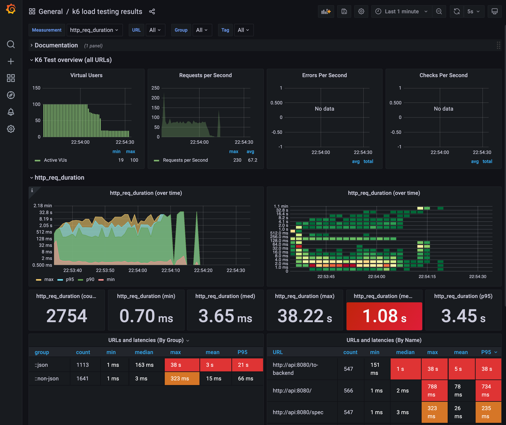

# artery

This is a template for running Express powered APIs on Azure App Service with:

- Blue-green zero-downtime deployments and all environments behind Azure AD auth
- Monitoring, alerts, availability tests and logging to analytics workspace
- OpenAPI middleware validating requests and routing to (TypeScript) handlers
- Azure Pipelines for updating Azure services and releasing Docker images to ACR
- A pipeline for importing/updating the API in existing Azure API Management(s)

Principles:

- OpenAPI driven development for mocking and enforcing req and res validations
- Generate both API tests and load tests automatically based on API definition
- Minimize number of environments, internal differences, maintenance and costs
- One command deploy PaaS with connectivity, monitoring and identity services
- Create Azure DevOps project and pipelines with IAC, requiring only Azure CLI

## 🔨 Development

Install development tools with [Homebrew](https://brew.sh/) on macOS and
Linux distros:

    brew bundle

If you cannot use Homebrew, install them manually.

Install Node.js version in `.nvmrc`:

    nvm install

Install Node.js packages:

    npm install

### Code

Build production `dist/`:

    npm run build

Start development server that watches for changes:

    npm run dev

### Test

Run functional tests on [Jest](https://jestjs.io/):

    npm test

Run API tests on [Newman](https://github.com/postmanlabs/newman):

    npm run test:api

Generate and run [k6](https://k6.io/) load tests and this API in Docker Compose:

    npm run k6

The Docker Compose stack includes
[Grafana dashboard](http://localhost:3000/d/k6/k6-load-testing-results)
for load test results:

### Observe

[Morgan](https://github.com/expressjs/morgan) is used as Express middleware for
logging HTTP requests to console.

See [localhost:8080/stats](http://localhost:8080) and login with username
and password `local` for real-time metrics by
[swagger-stats middleware](https://github.com/slanatech/swagger-stats).

When [deployed to Azure](bicep/README.md) username and password are
set in the App Service app settings and generated from the branch name and
from the commit SHA by the [Azure DevOps pipeline](devops/README.md).

In Azure, Node.js metrics are streamed to Application Insights and logs are
sent to Log Analytics Workspace.

## 🧰 Practices

### Scan vulnerabilities

Have [Trivy](https://trivy.dev) present in your system to run vulnerability,
secret, misconfiguration and license scans automatically on commit.

You may run the scans manually in the git working copy:

    npm run sec

Or to write `results/` in various different formats:

    npm run sec:html
    npm run sec:junit
    npm run sec:sarif

### Use pre-commit checks

[Husky](https://typicode.github.io/husky/#/) is used for running the static
code analysis tools defined in `.husky/pre-commit`:

- [Trivy](https://trivy.dev) for various security scans
- [Prettier](https://prettier.io/) for formatting code based on `.prettierrc`
- [ESLint](https://eslint.org/) for linting and fixing code based on `.eslintrc.js`
- [Spectral](https://stoplight.io/open-source/spectral/) for linting OpenAPI
- [Portman](https://github.com/apideck-libraries/portman) for updating API tests
  based on `openapi.yaml`

Husky is installed in Node.js development dependencies (on `npm install`).

### Use IDE checks

Use VSCode to install the VSCode extensions defined in `.vscode/extensions.json`
so linting, static analysis and formatting runs continuously write-time,
before code even ends up in a commit.

Have [Semgrep](https://github.com/returntocorp/semgrep) and
[hadolint](https://github.com/hadolint/hadolint) present in your system
to benefit from the VSCode extensions.

#### Linting

You may run [ESLint](https://eslint.org/) manually for linting the codebase:

    npm run lint:fix

Or [Spectral](https://stoplight.io/open-source/spectral/) manually for linting
the OpenAPI files:

    npm run lint:spec

#### Static analysis

You may run [Semgrep](https://github.com/returntocorp/semgrep) manually for the
codebase:

    npm run sa

### Virtualize APIs

Use [Prism](https://github.com/stoplightio/prism) locally to fake the APIs
defined in `openapi.yaml` that are not yet implemented:

    npm run prism:mock

Fake data is generated dynamically according to the `x-faker` properties in the
OpenAPI definition. See [Faker.js](https://github.com/marak/Faker.js#api-methods)
for all different kinds of test data to generate.

To run Prism so that the already implemented endpoints are responded by Express:

    npm run prism:proxy

Prism server is launched at [localhost:4010](http://localhost:4010), returning
mock responses for the non-implemented endpoints according to
`example`/`examples` properties in the OpenAPI definition (`openapi.yaml`).

This applies for all the routes which do not have handler set by the OpenAPI
properties `operationId` and `x-eov-operation-handler`: The Express will
respond HTTP status 501 (Not Implemented) for routes that do not have handlers
implemented, causing Prism then to mock the response.

## ⚙️ CI/CD

The git workflow is [trunk based development](https://trunkbaseddevelopment.com/).

The branches map to pipeline stages and target Azure environments as following:

| Branch |   Stage    | CI/CD | CDP | Deployment trigger                       | Cluster |
| ------ | :--------: | ----- | :-: | ---------------------------------------- | :-----: |
| `*`    |     PR     | ✔️    | ✔️  | The tests in the feature branch passed   |   stg   |
| `main` |  staging   | ✔️    | ✔️  | A PR was merged and tests passed in main |   stg   |
| `main` |     rc     | ✔️    | ✔️  | Post-deployment gates in staging passed  |  prod   |
| `main` | production | ✔️    |     | A person runs the production pipeline    |  prod   |

Stages `rc` and `production` re-use the artifacts from `staging`. Thus the only
task of the `production` pipeline is to roll out `rc` to `production`.

The infrastructure deployment pipelines are separated from the app deployment
for `staging`, `rc` and `production`.

For `PR` review environments, the infrastructure is created before the tests
are run.

### Azure App Service

Stages are implemented as slots in `stg` and `prod` App Services.

In App Services, swapping the slots is used for rolling out new app version.
This enables to configure App Services to do canaries and progressive delivery.

Slots can be swapped back to do a fast roll back. Database migrations, if any,
may have to be reverted to get back to the working state.

### Azure DevOps

Azure DevOps pipelines are used for building Docker images and deploying the
images to environments in Azure.

To create the Azure DevOps project and the pipelines in your Azure DevOps
organisation, see
[creating Azure DevOps resources programmatically](devops/README.md).

For **public Azure DevOps projects, don't allow PRs to be deployed**
without a review from a team member as doing so might compromise security.

## 🏗️ Infrastructure

Docker images are used as the primary distribution mechanism, thus this APIs
npm package is configured as private in `package.json`.

The Docker images can be hosted in any Docker registry and the containers will
run in any system having Docker present.

Regardless, Azure Container Registry and Azure App Service are preferred here
as the container registry and as the PaaS.

### Docker images

Multi-staged `docker/` files build the images as following:

- The first stage runs all tests before transpiling TypeScript to JavaScript
- The second stage copies JS files and installs only the production dependencies
- The final run-time image knows nothing about packages and only has pure JS

To build the API image locally and run the production server as container:

    docker/build_and_test_image

Or to run the API, as well as k6 and Grafana with Docker Compose:

    docker-compose up

By default, Alpine Linux based Docker images are built, but Debian Buster
(slim) Dockerfiles are also included in `docker/` if
[Alpine caveats](https://github.com/gliderlabs/docker-alpine/blob/master/docs/caveats.md) are present in your system.

Docker images are built by the CI/CD pipelines per environment and pushed to
the environment specific Azure Container Registry. When building the image,
`docker/build_and_test_image` and `docker/Dockerfile.alpine.prod` are used.

The only difference between non-prod and prod images is that non-prod will
install, configure (according to App Service's guidelines) and start the
SSH daemon which can help debugging Azure App Service in pull requests.

### Infrastructure-as-Code

Azure resources are designed to be updated by the _infra_ Azure DevOps pipeline
after initially having [created the Azure resources](bicep/README.md) for the
environments.
