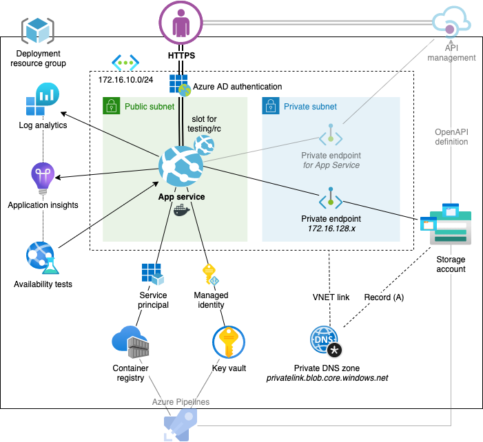
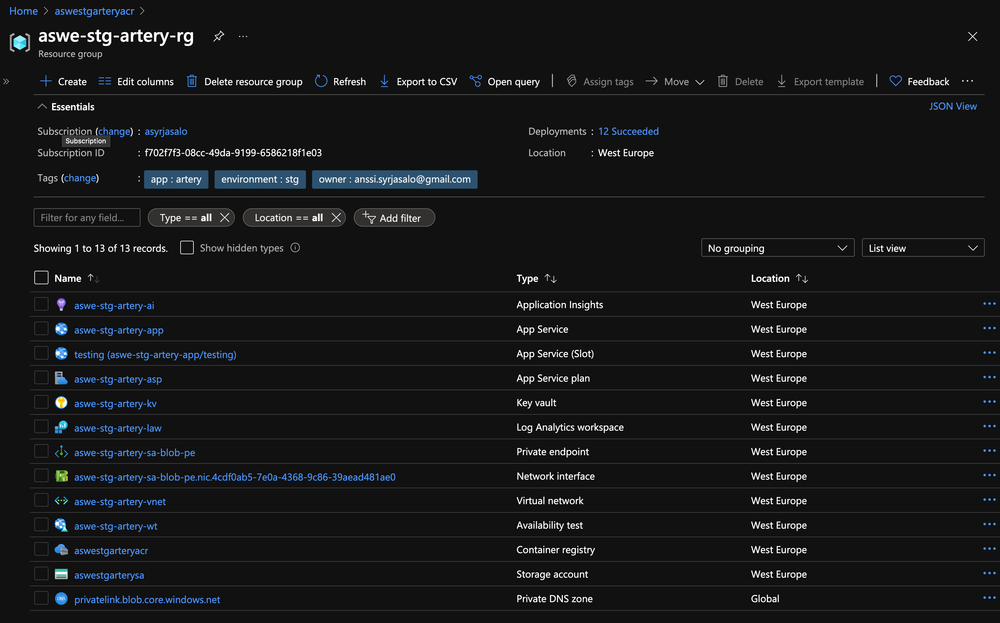
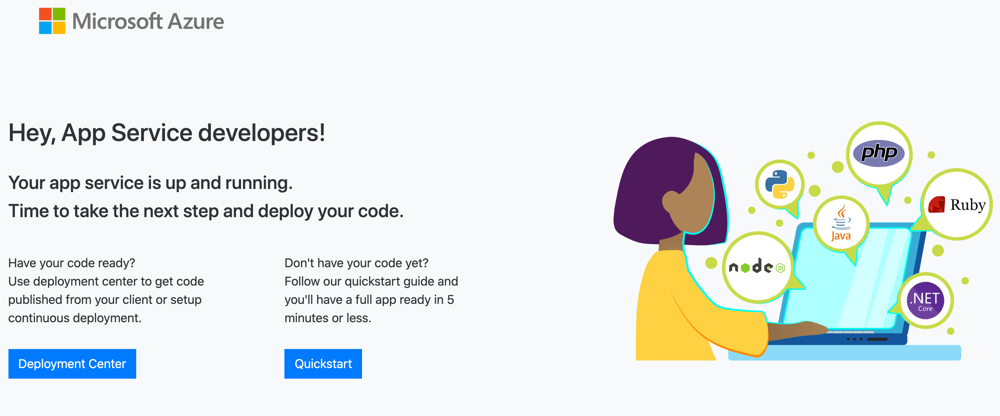
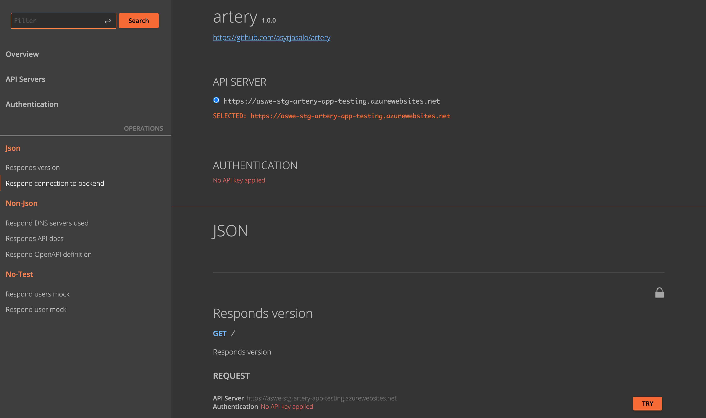
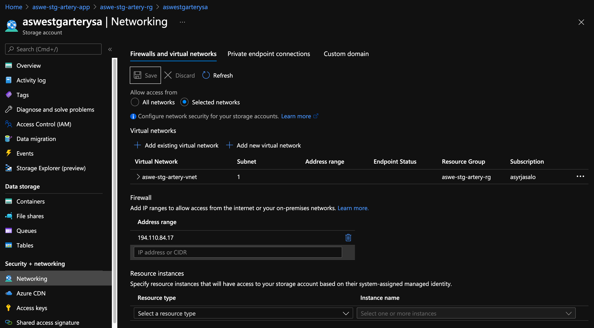
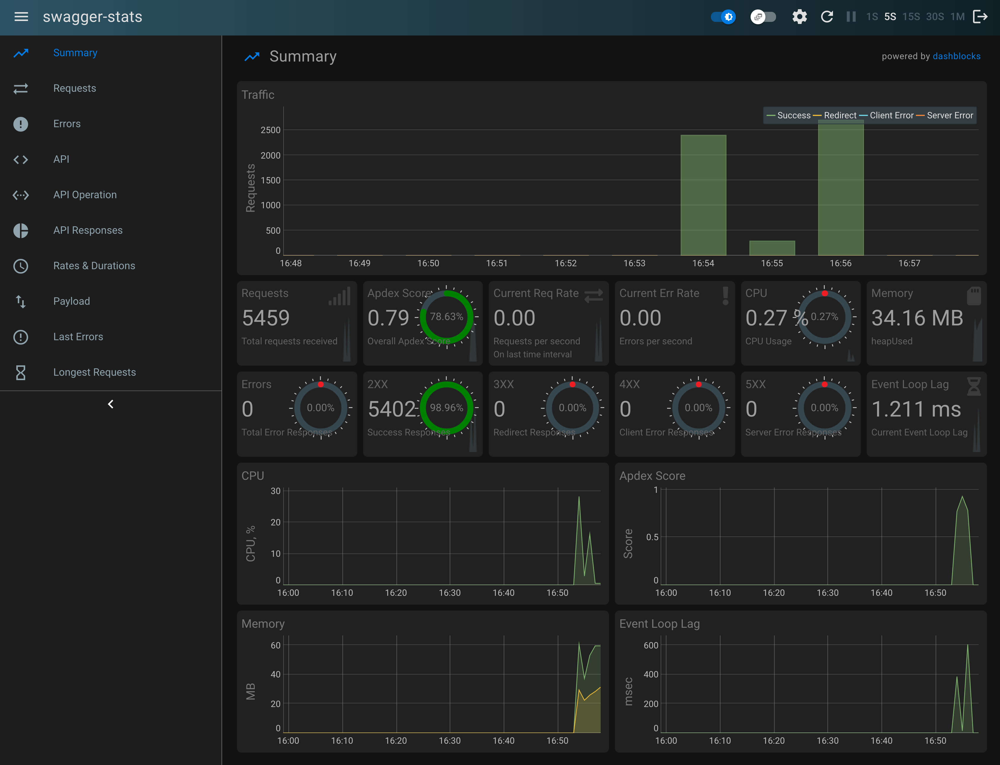

# Running on Azure App Service

This `README.md` summarizes [the blog post from 2021-08-08](https://rise.raas.dev/zero-to-paas/) which is more likely up-to-date.

This is a reference implementation that focuses on minimizing:

- **Failures** in releasing, by implementing zero-downtime and blue-green deployments
- **Costs** and maintenance caused only by the number of pre-production environments
- **Complexity** rising from differences between non-prod and prod environments
- **Risks** such as leaking environments to public Internet with no authentication
- **Obscurity** in application performance monitoring and logging solutions

Nevertheless, a full-featured PaaS is deployed, including:

- App Service with deployment slots, all environments behind Azure AD authentication
- Traffic, application and audit logging to Log Analytics Workspace
- Application Insights for real-time monitoring and alerts as push notifications to Azure mobile app
- Storage Account with a private endpoint (and private DNS) for persistent Docker volumes and long-term log storage
- Key Vault for secrets, App Service fetching them using a managed identity and over private networking
- Azure Container Registry for hosting Docker images, App Service pulling them with a service principal

Greyed out parts are not created by here but other scripts in the repository.

## Slots over App Service plans

We will deploy two resource groups, one for non-production (here, `stg`) and
one for production (`prod`). As we want to minimize the number of environments
and their maintenance work, effectively leading to costs, we target to use the
non-production App Service to implement all the internal environments (testing, staging).

Thus, the staging App Service will include, besides staging, a deployment slot
`testing` which is used similarly as any pre-staging environment usually is,
mainly integrating the upcoming features and fixes together into the mainline.

Note that this approach assumes (however, is not restricted to) also
**striving towards minimizing test data management** which starts best by using
a shared database for testing and staging. We assume staging is what is usually
used for internal demoing purposes and has the nearest production-like data.

Going from testing to staging is as simple as switching the slot `testing` as
the current live version in App Service. After the swap, note that the current
testing ought to be redeployed to `testing` where the previous staging is now
held, unless there is a particular case to keep the previous staging release.

Similarly, the production will include deployment slot `rc` which is dedicated
for any possible final checks that ought to be done (especially with production
data) before going live. Additionally, the `rc` slot can be used to implement
"canary" that is redirecting e.g 5% of the customers from the current production
to `rc`, allowing to pilot changes first with a smaller number of customers.

After swapping `rc` to production in AppService, the previous production is
held in slot `rc` so that if errors start occurring in production, the previous
production can be swapped back as fast as possible. Note that for this to work,
database migrations ought to be already run in `rc`. Sometimes errors only occur
with production data and for debugging them `rc` is also the most ideal.

For both staging and production, we will always deploy to the first
environment first before swapping it to the latter environment. This
ensures zero-downtime deployment in App Service, preferable not only in
production, but also in staging as there is often internal demoing going on.

We will later introduce Azure DevOps pipeline to do the swap, as well as
implement an approval stpe before swapping the slots in production. The approval
can be done via Azure Pipelines UI or by the named pressing Approve/Deny button
on a Slack channel (or similarly with MS Teams Azure DevOps integration).

## Creating PaaS resources

### Prerequisites

[Azure CLI](https://docs.microsoft.com/en-us/cli/azure/install-azure-cli?view=azure-cli-latest), Bash and
[Docker](https://www.docker.com/products/docker-desktop) are assumed present.

If you do not have them available in your OS, you can clone this repo in Azure
Cloud Shell and run the commands there.

Install or upgrade [Bicep](https://github.com/Azure/bicep):

    az bicep install
    az bicep upgrade

### Deploy with one command

If you want to create or upgrade the environment with one command,
copy `stg.env.example` to `stg.env`, configure variables and run:

    ./deploy stg.env

### Deploy steps clarified

The steps that `deploy` are explained below. You may run the script as part of
the continuous deployment but note that some downtime can occur depending on
tier of the App Service and the number of SKUs.

Export the variables:

    set -a; source stg.env; set +a

Create a target resource group for deployment:

    az group create \
        --name "$AZ_PREFIX-$AZ_ENVIRONMENT-$AZ_NAME-rg" \
        --location "$AZ_LOCATION" \
        --subscription "$AZ_SUBSCRIPTION_ID" \
        --tags app="$AZ_NAME" environment="$AZ_ENVIRONMENT" owner="$AZ_OWNER"

Create an AAD app to be used for authentication on the App Service and the slot:

    AZ_AAD_APP_CLIENT_SECRET="$(openssl rand -base64 32)"

    az ad app create \
        --display-name "$AZ_PREFIX-$AZ_ENVIRONMENT-$AZ_NAME-appr" \
        --available-to-other-tenants false \
        --homepage "https://$AZ_PREFIX-$AZ_ENVIRONMENT-$AZ_NAME-app.azurewebsites.net" \
        --reply-urls "https://$AZ_PREFIX-$AZ_ENVIRONMENT-$AZ_NAME-app.azurewebsites.net/.auth/login/aad/callback" "https://$AZ_PREFIX-$AZ_ENVIRONMENT-$AZ_NAME-app-$AZ_SLOT_POSTFIX.azurewebsites.net/.auth/login/aad/callback" \
        --password "$AZ_AAD_APP_CLIENT_SECRET"

Fetch the AAD app's client ID:

    AZ_AAD_APP_CLIENT_ID="$(az ad app list \
        --display-name "$AZ_PREFIX-$AZ_ENVIRONMENT-$AZ_NAME-appr" \
        --query "[].appId" --output tsv)"

Create a service principal for the above AAD app:

    az ad sp create --id "$AZ_AAD_APP_CLIENT_ID"

Next, ensure you have Azure AD role _Cloud Application Administrator_ in order
to be able to grant `User.Read` permission to the AppService and the slot.

Permission `User.Read` is the minimum required MS Graph API permission required
for AppService to implement authentication so that only members in your Azure
tenant will be able to access what is hosted by the AppService after AAD login.

If you do not have application administrator AAD role, you can either ask your
Azure tenant _Global Administrator_ to grant the role, or alternatively request
consent the created AAD app on behalf of the organization.

Grant User.Read on AAD Graph API to the App Service's AAD app:

    az ad app permission add \
        --id "$AZ_AAD_APP_CLIENT_ID" \
        --api "00000002-0000-0000-c000-000000000000" \
        --api-permissions "311a71cc-e848-46a1-bdf8-97ff7156d8e6=Scope"

    az ad app permission grant \
        --id "$AZ_AAD_APP_CLIENT_ID" \
        --api "00000002-0000-0000-c000-000000000000"

Next, we will create a dedicated service principal for App Service to be used
for pulling Docker images from your Azure Container Registry on deployment.

This is the second best option, as creating and using AppService's managed
identity unfortunately
[does not work](https://github.com/MicrosoftDocs/azure-docs/issues/64660)
for container registry operations.

Nevertheless, using a service principal is better option than leaving the ACR
admin account enabled using admin credentials just for pulling images from
a Docker registry on deploy.

Create a service principal for App Service (and slot) to pull images from ACR:

    AZ_ACR_SP_PASSWORD="$(az ad sp create-for-rbac \
        --name "$AZ_PREFIX-$AZ_ENVIRONMENT-$AZ_NAME-sp" \
        --skip-assignment \
        --only-show-errors \
        --query password --output tsv)"

    AZ_ACR_SP_CLIENT_ID="$(az ad sp list \
        --display-name "$AZ_PREFIX-$AZ_ENVIRONMENT-$AZ_NAME-sp" \
        --only-show-errors \
        --query "[].appId" --output tsv)"

    AZ_ACR_SP_OBJECT_ID="$(az ad sp list \
        --display-name "$AZ_PREFIX-$AZ_ENVIRONMENT-$AZ_NAME-sp" \
        --only-show-errors \
        --query "[].objectId" --output tsv)"

Finally, create a deployment in the resource group with Bicep:

    az deployment group create \
        --resource-group "$AZ_PREFIX-$AZ_ENVIRONMENT-$AZ_NAME-rg" \
        --subscription "$AZ_SUBSCRIPTION_ID" \
        --template-file main.bicep \
        -p prefix="$AZ_PREFIX" \
        -p name="$AZ_NAME" \
        -p environment="$AZ_ENVIRONMENT" \
        -p owner="$AZ_OWNER" \
        -p app_slot_postfix="$AZ_SLOT_POSTFIX" \
        -p acr_sp_client_id="$AZ_ACR_SP_CLIENT_ID" \
        -p acr_sp_object_id="$AZ_ACR_SP_OBJECT_ID" \
        -p acr_sp_password="$AZ_ACR_SP_PASSWORD" \
        -p aad_app_client_id="$AZ_AAD_APP_CLIENT_ID" \
        -p aad_app_client_secret="$AZ_AAD_APP_CLIENT_SECRET"

After the deployment finishes successfully, the rg content is as following:

Now going to App Service or the testing slot's URL, you will see the following:

Next, we will deploy the app with Docker.

## Deploying API to App Service

We will use an example API implemented in TypeScript and Express.js,
running on Node.js in Docker container.

The API implements endpoints for demonstarting private endpoint connectivity,
an example of hosting interactive API documentation powered by RapiDoc,
Express middleware _swagger-stats_ providing real-time statistics in web UI,
and _express-openapi-validator_ middleware for routing and validating the
HTTP request parameters based on the OpenAPI/Swagger definition.

If you want to deploy a more sophisticated solution for verifying connectivity
to the private endpoint fronted services, I recommend to take a look at the
[Janne Mattila's webapp-network-tester](https://github.com/JanneMattila/webapp-network-tester)

### Deploy to the slot for testing

Build Docker image (and run a container from it, printing the Node.js version):

    cd ..

    IMAGE_KIND="alpine" \
    BUILD_ARGS="--pull --no-cache" \
      docker/build_and_test_image node --version

Login to your Azure Container Registry:

    set -a; source bicep/stg.env; set +a

    az acr login --name "${AZ_PREFIX//-/}${AZ_ENVIRONMENT//-/}${AZ_NAME//-/}acr"

Push the Docker image to the registry:

    REGISTRY_FQDN="${AZ_PREFIX//-/}${AZ_ENVIRONMENT//-/}${AZ_NAME//-/}acr.azurecr.io" \
      docker/tag_and_push_image

Deploy a container from the image in the App Service slot:

    az webapp config container set \
        --name "$AZ_PREFIX-$AZ_ENVIRONMENT-$AZ_NAME-app" \
        --slot "$AZ_SLOT_POSTFIX" \
        --resource-group "$AZ_PREFIX-$AZ_ENVIRONMENT-$AZ_NAME-rg" \
        --subscription "$AZ_SUBSCRIPTION_ID" \
        --docker-registry-server-url "https://${AZ_PREFIX//-/}${AZ_ENVIRONMENT//-/}${AZ_NAME//-/}acr.azurecr.io" \
        --docker-custom-image-name "${AZ_PREFIX//-/}${AZ_ENVIRONMENT//-/}${AZ_NAME//-/}acr.azurecr.io/$AZ_NAME:main"

You can ignore the warning regarding the registry credentials, as username and
password are read from the Key Vault by the App Service's service principal.

Wait for the slot to restart or restart it immediately:

    az webapp restart \
        --name "$AZ_PREFIX-$AZ_ENVIRONMENT-$AZ_NAME-app" \
        --slot "$AZ_SLOT_POSTFIX" \
        --resource-group "$AZ_PREFIX-$AZ_ENVIRONMENT-$AZ_NAME-rg" \
        --subscription "$AZ_SUBSCRIPTION_ID"

Browse to `https://APP_SERVICE_SLOT_URL/docs`, authenticate with your Azure AD
account (if not already in) and you will see the API docs:

### Swap the slots

After experimenting with the API, swap the testing slot in the App Service:

    az webapp deployment slot swap \
        --name "$AZ_PREFIX-$AZ_ENVIRONMENT-$AZ_NAME-app" \
        --slot "$AZ_SLOT_POSTFIX" \
        --resource-group "$AZ_PREFIX-$AZ_ENVIRONMENT-$AZ_NAME-rg" \
        --subscription "$AZ_SUBSCRIPTION_ID"

Note that after the swap, the previous staging is now at the testing slot.
You may want to redeploy to the testing slot (similarly as done in the last
section) to have the testing up-to-date for the team to continue the work on.

Now, browse to `https://APP_SERVICE_URL/to-backend` to witness that the
DNS query from App Service to the Storage Account resolves to a private IP.

You can ignore the error message regarding the missing file, or alternatively
download the OpenAPI definition from endpoint `https://APP_SERVICE_URL/spec` and
upload it to the Storage Account's `public` container with name `openapi.yaml`
to get rid of the message.

Note: You have to add your own IP as allowed in the Storage Account's
Networking to be able to upload files over the public network:

We will later get to back this as the definition file will be used for importing
the API in Azure API Management. Note that there is technically nothing secret
in the in the OpenAPI definition itself (as the name hints :) as it is widely
used for telling the client apps how to programmatically connect to the API.

### Real-time stats for endpoints

Set [swagger-stats](https://swaggerstats.io/) username and password in
the App Service application settings:

    az webapp config appsettings set \
        --name "$AZ_PREFIX-$AZ_ENVIRONMENT-$AZ_NAME-app" \
        --slot "$AZ_SLOT_POSTFIX" \
        --resource-group "$AZ_PREFIX-$AZ_ENVIRONMENT-$AZ_NAME-rg" \
        --subscription "$AZ_SUBSCRIPTION_ID" \
        --settings SWAGGER_STATS_USERNAME=main \
                   SWAGGER_STATS_PASSWORD="$(git rev-parse HEAD)" \
                   PRIVATE_BACKEND_URL="https://${AZ_PREFIX//-/}${AZ_ENVIRONMENT//-/}${AZ_NAME//-/}sa.blob.core.windows.net/public/openapi.yaml"

    az webapp restart \
        --name "$AZ_PREFIX-$AZ_ENVIRONMENT-$AZ_NAME-app" \
        --slot "$AZ_SLOT_POSTFIX" \
        --resource-group "$AZ_PREFIX-$AZ_ENVIRONMENT-$AZ_NAME-rg" \
        --subscription "$AZ_SUBSCRIPTION_ID"

Now go to endpoint `/stats` and you will be presented with a login form, which
is not related to the Azure AD authentication (even though all the endpoints
are behind AD auth wall in any case). Use `main` as the username and SHA
of the last git commit as the password to log in.

## Operational best practices

### Monitoring

The back office was created as part of deployment but these practices are not
covered here in detail:

- Application Insights metrics which are streamed by the Express.js middleware
- Querying HTTP and audit logs in the Log Analytics Workspace
- Alerts for suddenly increased response time and decreased availability (SLA)
- Availability (web) tests ran for App Service from all the regions in the world

By default, alerts are sent to the Azure mobile app as push notifications,
recipient specified by the email configured as `$AZ_OWNER`. If not using
the mobile app, you may want to configure alternative ways of getting alerted
in `ai.bicep`.

### Service Endpoints

The `public` subnet is delegated for the App Service and all the possible
service endpoints are already enabled in the subnet, allowing to restrict the
inbound traffic to the subnet e.g. as done on the Key Vault side.

Traffic over service endpoints traverses in Azure backbone, although the target services continue to expose their public IPs. Regardless whether services are publicly or privately exposed authentication is enforced, except for blobs in
"public" container of the Storage Account, later to be read by API Management.

Azure Container Registry ought to be kept publicly reachable as it is required
(for Azure Pipelines) to build and push Docker images to the registry. The ACR
admin user is disabled **and ought not be enabled**, instead managed identities
or when they are not possible, service principals shall be used.

### Private Endpoints

The general guideline advocated by the reference is to use private endpoints for
all storage and databases App Service accesses underneath to fetch data from.
The private endpoints ought to be deployed in `private` subnet of the virtual
network, similarly as done for the Storage Account (`sa.bicep`) in `main.bicep`.

Besides storage services and databases, private endpoints can also be created
in front of both App Service and App Service slots. Note that this requires
running on a Premium-tier App Service plan, which is usually the case in
production but might not hurt in non-prod either now due to fewer environments.

While this effectively hides the App Service from public Internet entirely,
which is most likely welcome in production mission-critical systems (over
purely restricting the inbound traffic with the App Service's network rules),
there are currently a couple of limitations to be aware of:

- Azure availability monitoring stops working as there is no public endpoint
  anymore exposed by the App Service to run the tests for
- Deploying to AppService from Azure DevOps will not work unless running a
  self-hosted agent in a virtual network, the virtual network then peered
  with the App Service's virtual network.

While these are resolvable, especially the latter introduces maintenance of
CI/CD agents not in the scope of this reference. The App Service specific
private endpoints are left as a reference in `main.bicep` albeit commented out.

## Next steps

### Create production resources

Do it similarly except copy `prod.env.example` to `prod.env` and after
configuring the variables, run:

    ./deploy prod.env

### Create Function Apps instead

As Function Apps are essentially backed by the App Service technology, this
reference can be used to deploy Function Apps instead with minor changes to
parameters for `app.bicep`.

In addition, you have to set _App Service_ application setting
`FUNCTIONS_EXTENSION_VERSION` to runtime version, e.g. `~3`.

### Introduce CI/CD

See [creating Azure DevOps project](../devops/README.md) to update the Azure
resources and deploy Docker images to ACR and AppService from Azure Pipelines.

### Import API in Azure API Management

An existing Azure API Management service and `openapi.yaml` uploaded in the
Storage Account's (created as part of the deployment) `public` container
is assumed present.

Create and run [CI/CD pipeline api-to-apim](../devops/README.md#pipeline-for-deploying-api-to-apim-optional) to import/update the API
based on `openapi.yaml`. Note that API Management has to have managed identity
to authenticate to the target App Service with Azure AD.

After deployment, create a virtual network peering between the App Service's
virtual network and the virtual network the API Management. Enable Service
Endpoint for App Service in API Management's subnet (where it is delegated in)
and the traffic will traverse in Azure backbone network. You can then restrict
inbound only to the API Managment's subnet in the App Service network settings.
