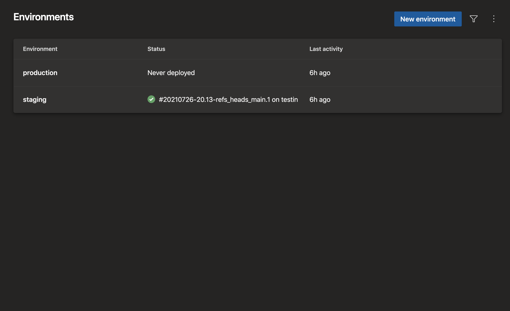

# CI/CD

Azure CLI [DevOps extension](https://github.com/Azure/azure-devops-cli-extension)
provided commands are used underneath for bootstrapping the Azure DevOps project
and the pipelines.

The CLI has its limitations (e.g. defining approval conditions in environments)
thus after IAC some manual steps are suggested as documented further below.

## Prerequisites

Azure resources are assumed already [created with Bicep](../bicep/README.md).

Below instructions assume that the source repository is hosted in GitHub.

For fetching the git repo in Azure Pipelines, preferable configure
[the Azure Pipelines GitHub app](https://docs.microsoft.com/en-us/azure/devops/pipelines/repos/github?view=azure-devops&tabs=yaml#github-app-authentication)
and grant repository access to your fork in the GitHub app configuration:

|  |
| ------------------------------------------------------------- |

Otherwise, create a
[GitHub personal access token](https://github.com/settings/tokens/new)
and select scope as _repo_ in the GitHub personal access token configuration:

|  |
| ---------------------------------------------------------------- |

For each pipeline, you still get recommendations to switch to GitHub app later:

|  |
| ------------------------------------------------------------------- |

## Setup tools

Login and install the Azure CLI DevOps extension:

    az login
    az extension add --name azure-devops --upgrade --yes

## Azure DevOps IAC

Each of the pipelines (infra, stg, prod) will have its own service connections
for GitHub, Azure Resource Manager and Azure Container Registry.

One service connection is are backed by one service principal which are
created by the scripts per pipeline as following:

Infra:

- GitHub
- AzureRm (the SP will have subscription _Contributor_)

Stg:

- GitHub
- AzureRm (the SP will have _Contributor_ in the testing-staging rg)
- Registry (the SP will AcrPush in the testing-staging ACR)

Prod:

- GitHub
- AzureRm (the SP will have _Contributor_ in the rc-production rg)
- Registry (the SP will have AcrPush in the rc-production ACR)

Copy `infra.env.example` to `infra.env`, configure variables and create project:

    ./create_azdo_project

Create `stg.env` from the example, configure its variables and create pipeline:

    ./create_azdo_pipeline stg.env

Create `prod.env` from the example, configure its variables and create pipeline:

    ./create_azdo_pipeline prod.env

Role _User Access Administrator_ is added to the infra SP in stg's and prod's
resource groups for `bicep/deploy` to assign the managed identity of the App
Service as Key Vault Reader and a service principal to ACR with role _AcrPull_.

### Infra SP's required Azure AD permissions

You may also have to assign Azure AD role _Cloud application administrators_
to the infra SP. This is for `bicep/deploy` to run the Azure AD related
commands for creating service principals and App Service AAD app successfully.

Whether this is required or not depends on your tenant's permissions for
creating/updating Azure AD resources as non-administrator. Assigning Azure AD
administrator roles to others requires _User Administrator_ role in the tenant.

### Pipeline to deploy API to APIM (optional)

If you have existing Azure API Management instance(s) and wish to import or
update the API there (based on APIs `openapi.yaml`), copy `apim.env.example` to
`apim.stg.env` and `apim.prod.env` and configure the variables in the files.

Here, the same _api-to-apim_ pipeline is used for both environments (~ stages).

To create API deploy pipeline and assign _Api Management Service Contributor_:

    ./create_azdo_api2apim apim.stg.env

To do the same for the production-dedicated API Management service:

    ./create_azdo_api2apim apim.prod.env

## Manual steps

The below are not supported by Azure CLI DevOps extension and although they
can be done via REST API, they are one-off operations and are fastest done
via Azure DevOps web GUI.

### Permit service connections

Because service principals per environment, service connections are not granted
access for all pipelines.

Also, when any of the pipelines is ran first time (or the service connections
are recreated by the IAC), the project administrator must approve the pipeline
to use the new service connection.

### Set pipeline triggers

For security, it is always recommeded to override the triggers defined
in `azure-pipelines` YAML files.

Do so for each pipeline in the pipeline settings as explained below.

#### testing-staging

Continuous integration: branch filters -> if include `main`

Pull reqest validation: branch filters -> if include `main`

- Require team member's comment before build
  - Only on pull request from non-team members

#### rc-production

- Continuous integration: branch filters -> if include `prod`
- Pull reqest validation: disabled

### Environments: Branch controls

These environments are created:

For 'staging', go to 'approvals and checks' and create a branch control check
for environment 'staging' with allowed branches as `refs/heads/main`, as pull
requests ought to be verified in the testing (App Service deployment slot).

Similarly for production, define allowed branches only as `refs/heads/prod`.

### Environments: Manual approvals

If no approval conditions are defined, changes will go to production
without confirmation. This as soon as branch `main` is merged to branch `prod`.

Thus for production:

- require approval (if set to a group -> one member of the group must approve)
- timeout e.g. 12h

Additionally, you may define manual approval for staging e.g. as following:

- require approval (optional, allow to self-approve)
- timeout e.g. 10min

### Process fine-tuning

If using Slack and the Azure DevOps Slack app, the pending approvals are
notified on the channel and can be approved or denied there with a button.

- Create other service hooks e.g. teams notifications, etc.

- Pipelines Settings: Change days to keep runs 30 -> 365 (and PRs 10 -> 30)

- If only using Azure DevOps for pipelines, you may disable unused services:

